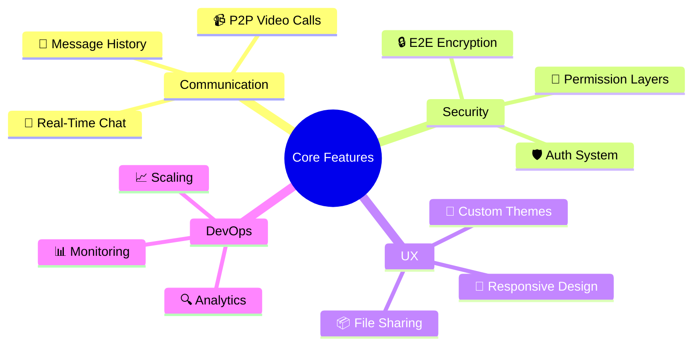
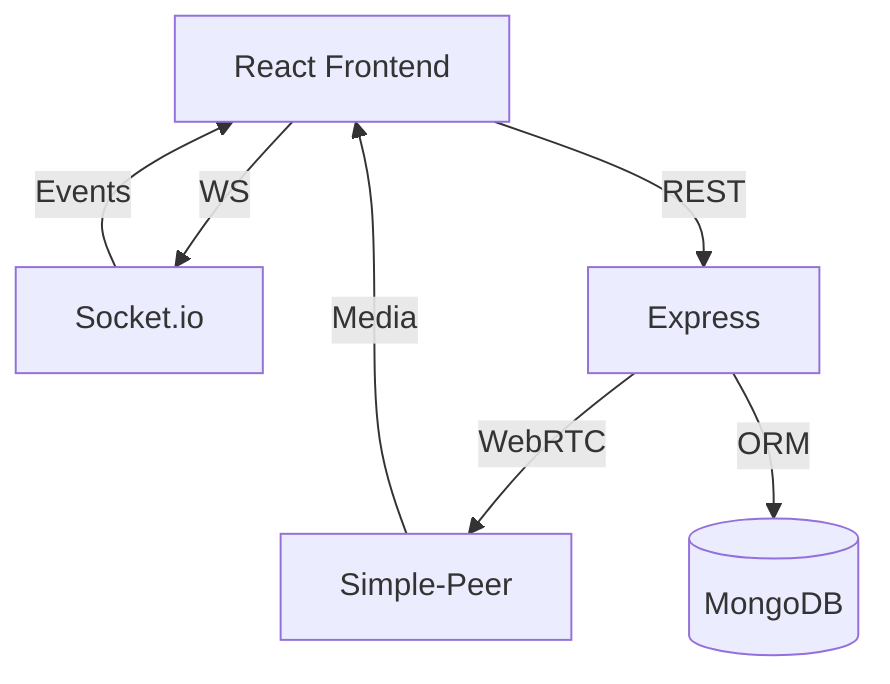
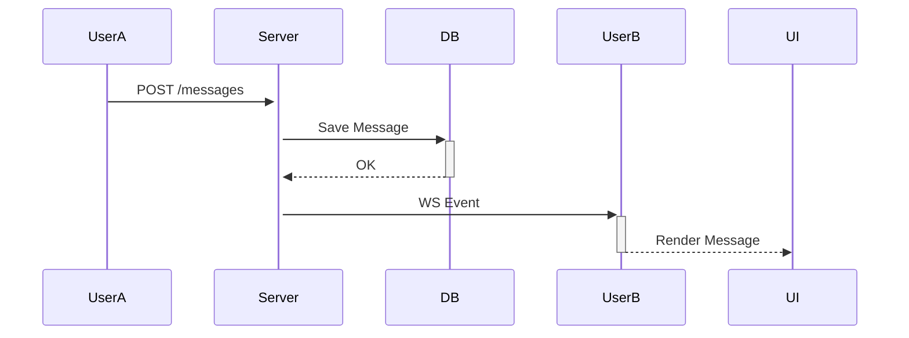
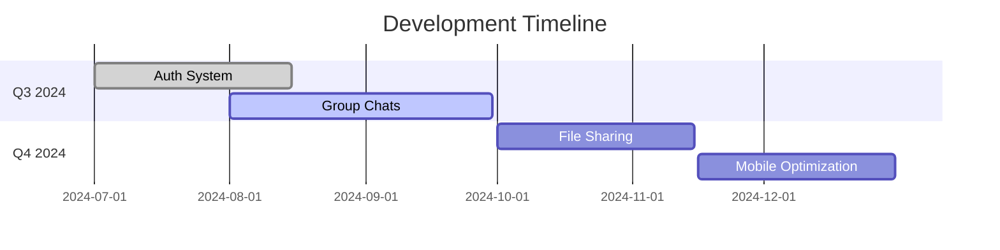

# 💬📹 Real-Time Chat & Video Call Suite

<div align="center">

[](https://react.dev/)
[](https://webrtc.org/)
[](https://socket.io/)
[](https://www.mongodb.com/)

**Enterprise-grade communication platform with E2E encryption and ultra-low latency**

</div>


---


## 🌟 Table of Contents

- [🚀 Features](#-features)
- [🏗 Architecture](#-architecture)
- [🛠 Tech Stack](#-tech-stack)
- [⚙️ Deployment](#️-deployment)
- [📱 Usage Guide](#-usage-guide)
- [🔮 Roadmap](#-roadmap)
- [📜 License](#-license)

---

## 🚀 Features



---

## 🏗 Architecture

### Full-Stack Overview



### Client Structure

```bash
chat-app/
└── client/
    └── src/
        ├── components/
        │   ├── Chat/           # Message Thread
        │   ├── VideoBridge/    # WebRTC Manager
        │   └── Auth/           # Security Gateway
        ├── hooks/              # Custom React Hooks
        └── stores/             # Zustand State
```

---

## 🛠 Tech Stack

### Frontend

| Component | Choice | Reason |
|-----------|--------|--------|
| Framework | React 18 | Component-driven architecture |
| State | Zustand | Lightweight global management |
| RTC | Simple-Peer | WebRTC abstraction |
| Styling | CSS Modules | Scoped styles |

### Backend

| Component | Choice | Reason |
|-----------|--------|--------|
| Runtime | Node.js 20 | Async I/O performance |
| Framework | Express 5 | Minimalist routing |
| ORM | Mongoose 8 | MongoDB modeling |
| WS | Socket.io 4 | Real-time events |

---

## ⚙️ Deployment

### Local Development

```bash
# Clone & Setup
git clone https://github.com/your-username/react-chat-video-app.git
cd react-chat-video-app

# Server Setup
cd server && npm ci
echo "MONGODB_URI=mongodb://localhost:27017/chatapp" >> .env
npm run dev

# Client Setup
cd ../client && npm ci
npm run start
```

### Production Build

```bash
# Server
npm run build && pm2 start dist/index.js

# Client
npm run build && serve -s build -l 3000
```

---

## 📱 Usage Guide

### Chat Interface



### Video Call Flow

1. **Initiate Call**
```js
const peer = new SimplePeer({
  initiator: true,
  trickle: false
});
```

2. **Signal Handling**
```js
peer.on('signal', data => {
  socket.emit('signal', data);
});
```

---

## 🔮 Roadmap



---

## 📜 License

This project is licensed under the MIT License - see the [LICENSE](LICENSE) file for details.

---

<div align="center">
  🔧 Built with ❤️ by [Your Name] | 
  📨 [Contact Support](mailto:support@example.com) | 
  🐛 [Report Issue](https://github.com/your-username/react-chat-video-app/issues)
</div>
```
